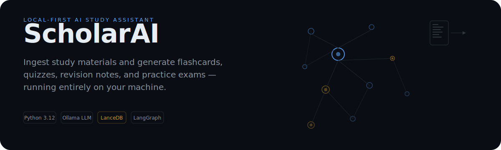

<p align="center">
  
</p>

## What is ScholarAI?

ScholarAI is a **local-first AI study assistant**. It ingests PDFs, Markdown, CSV, and XLSX files into a local vector database, then uses local LLMs via [Ollama](https://ollama.ai) to generate flashcards, quizzes, mindmaps, revision notes, diagrams, and practice exams. Your documents, embeddings, index, and artifacts never leave your machine.

## How it works

Your study materials are chunked, embedded, and indexed in **LanceDB** with hybrid BM25 + vector search. When you ask a question or request a study artifact, ScholarAI retrieves the most relevant material, applies reranking and verification, and generates grounded responses with full source citations. The entire pipeline is built on **LangGraph**, with an interactive execution trace available for every query.

## Features

| Study Tools | Knowledge & Analytics | Platform |
|---|---|---|
| SM-2 spaced repetition flashcards | Hybrid BM25 + vector search with reranking | Background job queue with restart survival |
| Auto-generated quizzes with scoring | Concept graph with semantic relationships | Per-provider token tracking and budgets |
| AI-generated Mermaid diagrams | Prerequisite-based learning paths with mastery scoring | Manual and scheduled LanceDB backups |
| Mindmaps and revision notes | Cross-artifact validation and quality scoring | Plugin system (Excalidraw, PlantUML, cloud providers) |
| PYQ analysis and timed mock exams | LLM-graded subjective answers | System health and model availability monitoring |
| In-browser PDF reader with highlights, bookmarks, and sticky notes | Custom prompt management with enhancement coaching | Cross-artifact full-text search |
| Human-in-the-loop artifact generation workflow | LLM-based artifact recommendations | Cloud provider auto-fallback to local models |

## Quick start

**Prerequisites:** [uv](https://docs.astral.sh/uv/getting-started/installation/) and [Ollama](https://ollama.ai).

```bash
# One-liner (Linux/macOS)
curl -fsSL https://github.com/SaptanshuWanjari/Scholar-AI/archive/refs/heads/main.tar.gz | tar xz && cd Scholar-AI-main && uv sync && echo "Ready. Run './start.sh' to launch."
```

Or download the latest release from [GitHub Releases](https://github.com/SaptanshuWanjari/Scholar-AI/releases) for your platform, then:

```bash
# Linux / macOS
./setup.sh    # first run: install dependencies
./start.sh    # launch

# Windows (PowerShell)
.\setup.ps1   # first run
.\start.ps1   # launch
```

Pull the recommended local models:

```bash
ollama pull qwen3:8b
ollama pull gemma4:12b
ollama pull qwen3-embedding:0.6b
```

Cloud providers (Gemini, Groq) can be connected during onboarding or from Settings. Open `http://localhost:8000` in your browser.

**Updating:**

```bash
./update.sh   # Linux/macOS — data in data/ is preserved
.\update.ps1  # Windows
```

## Privacy

ScholarAI collects **no telemetry, no analytics, and no user data**. Everything runs locally:

- Documents, embeddings, vector indexes, chat history, and artifacts live in `data/`.
- If you connect a cloud LLM provider, only the prompt text is sent to that provider's API.
- No accounts. No sign-up. Your study data is yours.

## Tech stack

| Backend | Frontend |
|---|---|
| Python 3.12, FastAPI, Typer | React 19, Vite, TypeScript |
| LangGraph, LangChain | Tailwind CSS, shadcn/ui |
| LanceDB (vector + BM25) | Zustand, React Router |
| SQLite, SQLAlchemy | Mermaid, Excalidraw |
| Ollama (local LLM) | |

## Development

```bash
# Start Ollama
ollama serve

# Pull models
ollama pull qwen3:8b
ollama pull gemma4:12b
ollama pull qwen3-embedding:0.6b

# Backend
uv sync
uv run scholar serve       # API at http://localhost:8000

# Frontend
cd frontend
npm install
npm run dev                # http://localhost:5173
```
